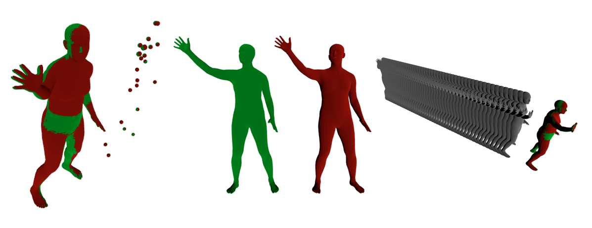

# Body Pose Forecasting

Forecast future human body poses using autoregressive modeling in the Vposer latent space.

## Project Description
- Forecast future human poses from past sequences.
- Use MLP-based autoregressive model.
- Quantitative evaluation using MPJPE (Mean Per Joint Position Error).
- Qualitative visualization of best, average, and worst predictions.

## Dataset
- AMASS dataset encoded with Vposer latent space.
- 120 fps frame rate (8.33 ms per frame).
- 50-frame input window and 1-frame output.
- **Dataset will be sent upon request.**
